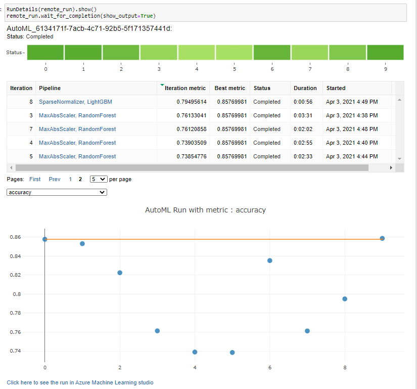

Azure Machine Learning Engineer

This is the final project which is the Capstone in the Udacity Azure Machine Learning Engineer Nanodegree. 
This project requires the expertise in the Azure Cloud Machine learning technologies. 
This acts as the final step in practically implementing the knowledge that I have gathered from the nanodegree.

## Project Set Up and Installation
1. This project has been trained locally by using Jupyter Notebook
2. A subscirption to Azure
3. Datasets need to be preprocessed and feature engineering
4. There are two experiments were run using Auto-ML and HyperDrive
5. The best model has been deployed and consumed with web API
## Dataset

### Overview
The dataset used in this project is from UCI Machine Learning Repository, which is public datasets for data science community. 
This census income dataset has 16281 columns and contains categorical and numerical variables. 
The dataset is stored in the Excel with csv format, and it is imported into Python for pre-processing 

### Task
The goals of this project are to identify what factors are best correlated with level of income and how those factors could help to build a machine learning model. 
The dataset consists of people social characters such as age, sex, education, occupation, martial-status etc located in USA and other countries

Features:

Class-label: High:>50K, and Low: <=50K.

age: continuous.

workclass: Private, Self-emp-not-inc, Self-emp-inc, Federal-gov, Local-gov, State-gov, Without-pay, Never-worked.
fnlwgt: continuous.

education: Bachelors, Some-college, 11th, HS-grad, Prof-school, Assoc-acdm, Assoc-voc, 9th, 7th-8th, 12th, Masters, 1st-4th, 10th, Doctorate, 5th-6th, Preschool.

education-num: continuous.

marital-status: Married-civ-spouse, Divorced, Never-married, Separated, Widowed, Married-spouse-absent, Married-AF-spouse.

occupation: Tech-support, Craft-repair, Other-service, Sales, Exec-managerial, Prof-specialty, Handlers-cleaners, Machine-op-inspct, Adm-clerical, Farming-fishing, Transport-moving, Priv-house-serv, Protective-serv, Armed-Forces.

relationship: Wife, Own-child, Husband, Not-in-family, Other-relative, Unmarried.

race: White, Asian-Pac-Islander, Amer-Indian-Eskimo, Other, Black.

sex: Female, Male.

capital-gain: continuous.

capital-loss: continuous.

hours-per-week: continuous.

native-country: United-States, Cambodia, England, Puerto-Rico, Canada, Germany, Outlying-US(Guam-USVI-etc), India, Japan, Greece, South, China, Cuba, Iran, Honduras, Philippines, Italy, Poland, Jamaica, Vietnam, Mexico, Portugal, Ireland, France, Dominican-Republic, Laos, Ecuador, Taiwan, Haiti, Columbia, Hungary, Guatemala, Nicaragua, Scotland, Thailand, Yugoslavia, El-Salvador, Trinadad&Tobago, Peru, Hong, Holand-Netherlands.

### Access
The dataset has been upload to Azure blob storage and registered into Azure Machine Learning dataset register

## Automated ML
1. a compute cluster has been created with STANDARD-D2-V2
2. the number of iteration has set to 10
3. primary metric for automated ML to monitor is accuracy
4. number of cross validation is 3

### Results
Here is the run details below:

Below is the best model with its hyperparameters

## Hyperparameter Tuning
I have chose the logistic regression for this dataset, and The Bayesian Parameter Sampling method has been used. 
The hyperparamters are shown below:
1. C: is nverse of regularization strength. Smaller values cause stronger regularization. 
      values have choose in 0.1,0.001,0.01,1,10,15,100
      Tryinf with different regularization strength from strong to weak will make model generalize data better
2. max_iter: controls maximum iterations the model will train
             values have choose in 1000,1500,2000

### Results
The best parameters are:
['--C', '0.1', '--max_iter', '1500']
{'Accuracy': 0.8274223034734918}
The way to improve this model is to train longer time as well as with large dataset

## Model Deployment

The Automated ML has been deployed to endpoints with auth enabled. We can consume the endpoint by access web API via
Python, C# and R. In this project, we have used Python.

Save with HyperDrive model, the endpoint has been consumed with Python via scoring url and auth key has been passed. 
The input data format must be in json.
